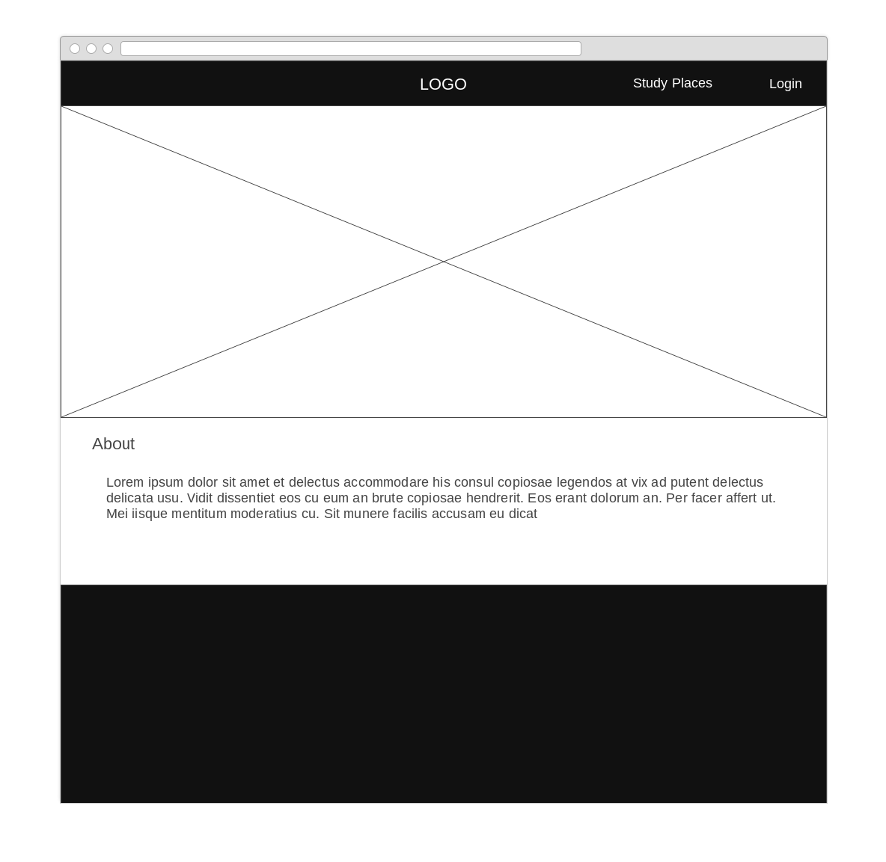
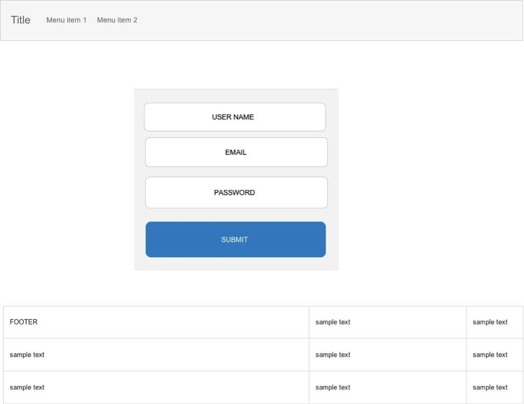
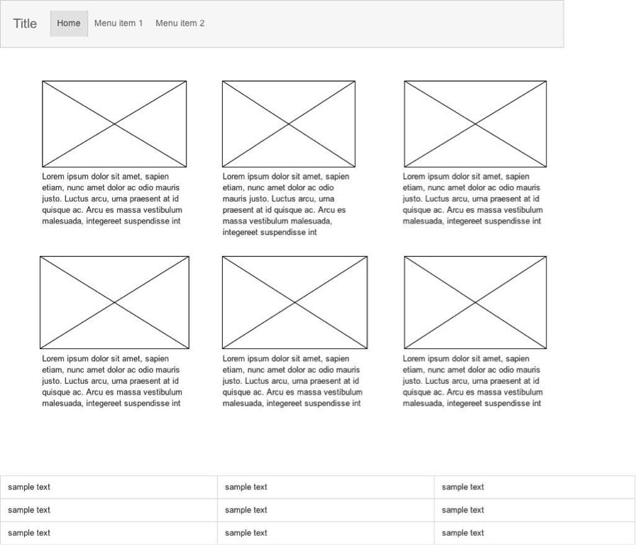
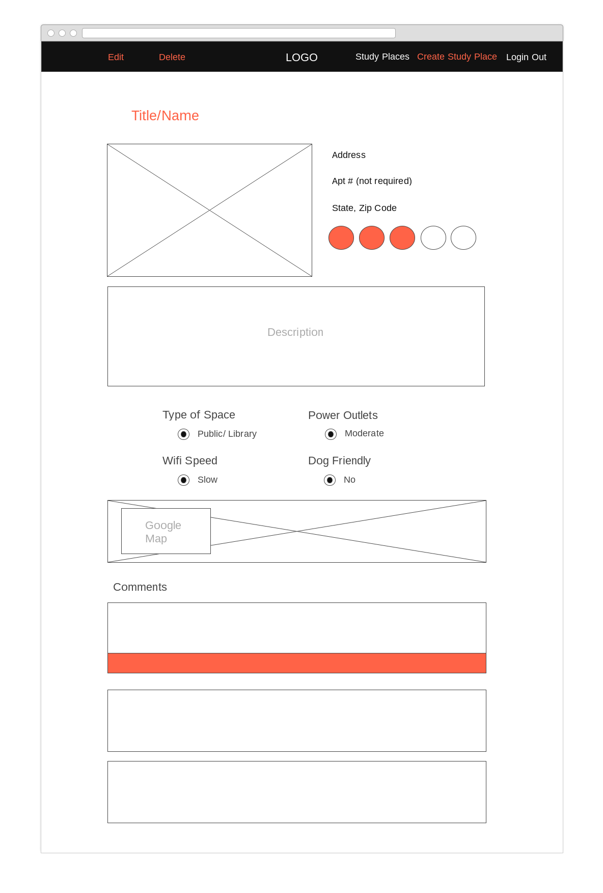
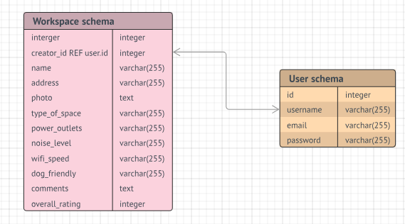

# Workspaces
Workspace reviews you can trust! Powered by the community.
### Live (url): tbd
### Team: Jhedi, Linda, Michele, Tim.

Table of Contents
=================

   * [Table of Contents](#table-of-contents)
         * [Overview](#overview)
      * [Wireframes](#wireframes)
         * [Home Page](#home-page)
         * [Login Page](#login-page)
         * [Main Page](#main-page)
         * [View Space](#view-space)
         * [Add Space / Edit Space](#add-space--edit-space)
      * [Database Schema](#database-schema)
      * [Components](#components)
      * [User Stories](#user-stories)
      * [Technologies Used](#technologies-used)
         * [Core](#core)
         * [Middleware](#middleware)
         * [APIs](#apis)
         * [Also](#also)
      * [Code Snippets](#code-snippets)
      * [Deployment](#deployment)
         * [MVP](#mvp)
         * [Post MVP](#post-mvp)

### Overview
The Workspaces app shows a list of work-friendly locations such as libraries, cafes and parks. Each location is sourced from app users who include rankings on categories such as noise level, wi-fi speed, dog-friendliness, among others.
## Wireframes

### Home Page

### Login Page

### Main Page

### View / Edit / Delete Space

## Database Schema

## Components
Home page
Login/register page
Index page (show all)
Display/edit/create page (show one)
## User Stories
User wants reviews and commentary on places to work out of.
User navigates to app and registers.
User login and views available views of workspaces.
User views indvidual workspace to review its features, such as wifi speed, outlets, etc.
User creates a workspace to add his/her review.
User edits or deletes his/her workspace(s).

## Technologies Used
- npm package manager
- node.js
- Express.js
- React and React Router
### Core

### Middleware

- morgan
- body-parser
- bcrypt
- concurrently
- dotenv
- express
- jwt-js
- jsonwebtoken
- nodemon
- slick-carousel
- react-slick
- semantic-ui-react
- semantic-ui-css

### APIs
- Google Maps API
### Also
- LucidChart
- Wireframe CC
## Code Snippets

componentDidMount() {
    // const script = document.createElement("script");
    //   script.src = "https://maps.googleapis.com/maps/api/APIkeySECRET";
    //   script.async = true;
    //   document.body.appendChild(script);

    const mapElement = this.mapElement;

    this.map = new window.google.maps.Map(mapElement, {
      zoom  : INITIAL_MAP_ZOOM_LEVEL,
      center: {
        lat : INITIAL_LOCATION.position.latitude,
        lng : INITIAL_LOCATION.position.longitude
      }
    });
    this.marker = new window.google.maps.Marker({
      map: this.map,
      position: {
        lat: INITIAL_LOCATION.position.latitude,
        lng: INITIAL_LOCATION.position.longitude
      }
    });
    this.geocoder = new window.google.maps.Geocoder();
  }

## Deployment
### MVP
- User authentication and authorization
- Display all locations.
- Add, display, edit and delete locations
- Display individual location on Google map
### Post MVP
